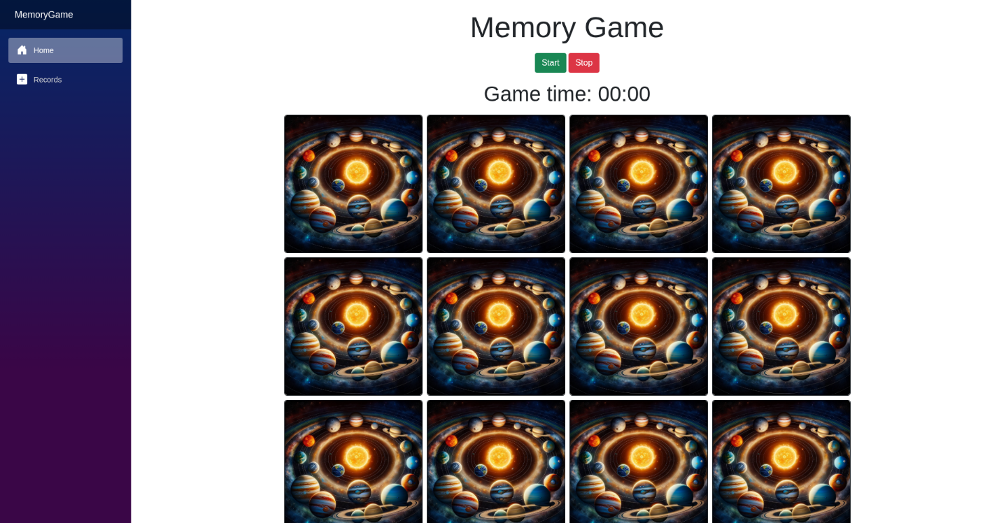
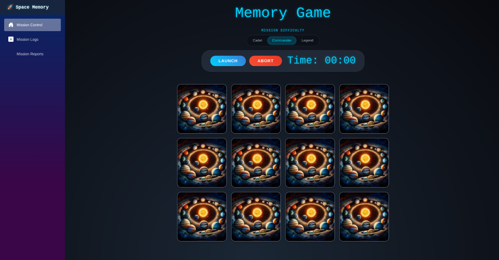

- [Memory Game (Blazor Server)](#memory-game-blazor-server)
  - [🚀 Features](#-features)
  - [🛠️ Tech Stack](#️-tech-stack)
  - [🏁 Getting Started](#-getting-started)
    - [Prerequisites](#prerequisites)
    - [Installation and Run](#installation-and-run)
  - [🏗️ Project Structure](#️-project-structure)
  - [💡 Implementation Details](#-implementation-details)
  - [🙏 Credits](#-credits)
- [General thoughts](#general-thoughts)
  - [The Good](#the-good)
  - [Challenges](#challenges)
  - [Areas of Improvement](#areas-of-improvement)

# Memory Game (Blazor Server)

A space-themed memory match game built with .NET 10 and Blazor Server. Challenge your cognitive skills by matching pairs of celestial bodies across multiple difficulty levels, tracking your progress through detailed performance metrics and historical mission logs.

## 🚀 Features

- **Thematic Gameplay**: Engaging space-themed interface featuring high-quality celestial assets.
- **Dynamic Difficulty**: Multiple difficulty settings (Easy, Medium, Hard) to challenge players of all skill levels.
- **Progress Tracking**: Real-time elapsed time tracking for each game session.
- **Mission History**: Comprehensive logs of past games, allowing players to review their performance over time.
- **Data Persistence**: Uses `ProtectedLocalStorage` to ensure game scores are securely saved within the browser.
- **Performance Analytics**: Aggregated reports and statistics to visualize improvements and gameplay trends.
- **Adaptive UI**: Optimized layouts for different difficulties, including automatic viewport adjustment for larger game fields.

## 🛠️ Tech Stack

- **Framework**: .NET 10 (ASP.NET Core)
- **UI Framework**: Blazor Server with Razor Components
- **Language**: C# 14.0
- **Storage**: Protected Browser Storage (`ProtectedLocalStorage`)
- **Styling**: Bootstrap and custom CSS

## 🏁 Getting Started

### Prerequisites

Ensure you have the .NET 10 SDK installed on your machine. You can verify your installation by running:

```bash
dotnet --version
```

### Installation and Run

1. **Clone the repository**:
   ```bash
   git clone <repository-url>
   ```
2. **Navigate to the project directory**:
   ```bash
   cd Blazor/MemoryGame
   ```
3. **Run the application**:
   ```bash
   dotnet run --project MemoryGame
   ```

The application will be available at the URL specified in the console output.

## 🏗️ Project Structure

The project follows a feature-based organization for better maintainability:

```text
MemoryGame/
├── Features/
│   ├── Game/          # Core gameplay components and logic
│   ├── Scores/        # Historical mission logs and past score views
│   ├── Reports/       # Statistical analysis and performance reports
│   ├── Layout/        # Shared application shell and navigation components
│   ├── Error/         # Standardized error handling views
│   ├── App.razor      # Root application component
│   └── Routes.razor   # Centralized route definitions
├── Models/            # Domain entities (Card, Score, Difficulty, etc.)
├── Services/          # Business logic (Game state, Scoring, Card generation)
├── wwwroot/           # Static assets (Images, CSS, JS)
├── Program.cs         # Application entry point and service registration
└── MemoryGame.csproj  # Project configuration
```

## 💡 Implementation Details

- **Secure Persistence**: User scores are stored using `ProtectedLocalStorage`, providing a layer of protection for data stored in the browser.
- **Data Seeding**: The application includes a seeding mechanism that provides initial sample data if no local scores are found, ensuring the Reports page is immediately informative.
- **User Experience Enhancement**: For the "Hard" difficulty level, the game automatically scrolls the playfield into view to ensure a seamless experience across different screen sizes.

## 🙏 Credits

This project utilizes the [Planets Asset Pack](https://kenney.nl/assets/planets) created by **Kenney**.

# General thoughts
## The Good
First time using a feature-based organisation for Blazor. It works pretty good. In the future I think I'll use a more elaborate name for the pages rather than Index. I think in larger projects it would make it easier to search.

##  Challenges
I used AI for the UI, the difficulty selector, and the records page. It ended up really good. Better than what I made initially. A big plus was also the short amount of time it took.

Before:


After:


Not only did it nail the colours. It even added soul. I originally thought I'd make the difficulty selector a drop-down menu. But the AI chose buttons, which was a great choice. If that wasn't enough the choice of words for the difficulties and menu items is top-notch. I would've chosen easy, medium, etc.

And it was just a couple of fairly lazy prompts:
```
Improve the ui. Make it more playful. Take space and planets as a theme. Use bootstrap as much as possible. If you need to add some custom css for details, try to keep it as modular as possible (for example if used for 3 or more elements). 
```

```
Add a way to select the difficulty. It should have at least 3 difficulties. Don't implement the logic for changing the card amounts. Only do the html and styling.
```

My goal now is to find out how to use AI in my learning process. Back- and front-end on its own are already lot of work. So I don't mind too much on skimping on the design part. But it's hard not to use it for everything else when's it's faster, better or in worst case good enough. I think it was [The Odin Project](https://theodinproject.com) where I learned that having a solid foundation on vanilla JS is important to future proof yourself against any new FoTM frameworks. So that's what I will try to aim for in my learning process, and try to apply this to AI as well.

##  Areas of Improvement
- Not really happy about the architecture. I put the game state and logic into its own service, because it made the game page code too bloated. Now the page is clean but the service is bloated. Then there's other pages (i.e. the reports page) that are more like an SFC.
- In a next project if I implement feature-based organisation again I'll try to name the index pages to something like `FeaturePage`. I want to see if it improves searching/finding.
- Make the playing field more responsive instead of using the hackish solution with javascript to scroll the field into view. Either create a set amount of fields based on the window size or limit which difficulties can be selected/played.
- The top of the records page has left over space I could've filled with different kinds of stats.
- Adding tests. Especially an end-to-end test or ui-test would come in hand here. Sometimes I feel like there are small hiccups that I can't replicate. So an automated test could probably pick those up and log them.
